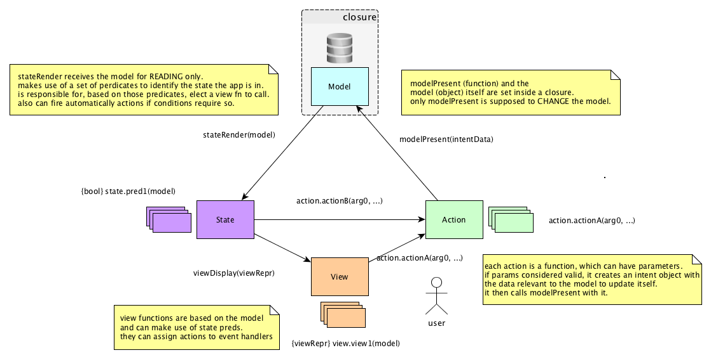

# SAM Rocket example in Snabbdom

This is my take on [SAM](http://sam.js.org/)'s [rocket example](http://sam.js.org/#samples),
using [snabbdom](https://github.com/paldepind/snabbdom).

## Diagram summary:

    State > Action > Model

    model -render-> state

    state -pureFn-> view

    state -nextAction-> action (can be auto-invoked)
      OR
    view  -userAction-> action

    action -present-> model

## Concepts definition:

a VIEW as pure function of the model

each ACTION is a pure function, receiving optional parameters.  
valid actions should invoke modelPresent with an object defining the change intended to be applied to the model

the MODEL contains all application state and should not be tampered with directly.  
it exposes a single function, modelPresent, receiving the action intent.  
that function is responsible for accepting the action intent and if valid, change model internals.  
stateRender shall then be called, passing the model in for READING only.

STATE here does not hold state at all. more like a state machine.  
it exposes predicates based on model (state).  
is a pure function of the model (stateRender) which should:
* compute the next action predicate, that is, identify if the model shall trigger an action automatically or not
* decide how to translate the model into view (elect the best appropriate view fn)

## What are these other JS files?

The relevant code is in `PROGRAM.js`.  
In there I implement the [rocket launcher example](https://bitbucket.org/snippets/jdubray/9dgKp/sam-sample).  
It receives the 2 snabbdom's function I need, `h` and `patch`.  
If you don't know snabbdom, [this article](https://medium.com/@yelouafi/react-less-virtual-dom-with-snabbdom-functions-everywhere-53b672cb2fe3)
is a nice intro to it (first examples should suffice).

`snabbdom_single.js` was generated via [browserify](http://browserify.org/)
in order for me (and you) to be able to use snabbdom on the browser without any tooling.  
It creates a distributable [snabbdom](https://github.com/paldepind/snabbdom) file,
exposing its symbols h and patch to a `PROGRAM` function, defined elsewhere (in the `PROGRAM.js` file).

If by any chance you want to update the `snabbdom_single.js` file, do:

    npm install
    npm run generate
